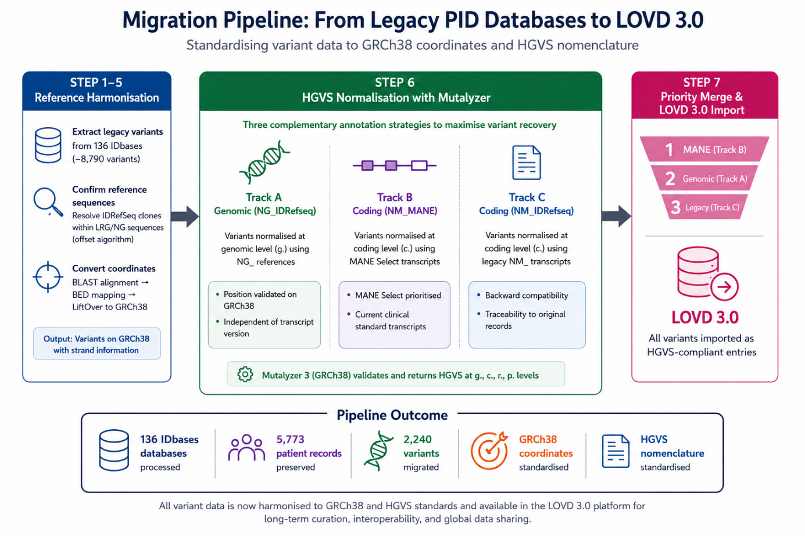

# Migrating BMC IDbases to LOVD

[](LICENSE)
[](https://www.python.org/)
[](https://www.ncbi.nlm.nih.gov/grc)
[](https://hgvs-nomenclature.org/)
[](https://doi.org/10.5281/zenodo.20886949)

A reproducible Python pipeline that migrates the **IDbases** immunodeficiency variant
collection — roughly three decades of expert curation — from the legacy MUTbase
platform into **LOVD 3.0**, standardizing every coordinate to **GRCh38** and every
variant to **HGVS** nomenclature.

> Master's thesis, Biotechnology — Lund University (LTH).
> Supervisor: Prof. Mauno Vihinen. Examiner: Ghjuvan Micaelu Grimaud.
> 📄 Thesis: _[TBA]_

---

## Why this matters

IDbases holds variant records for 136 immunodeficiency genes accumulated over ~30 years,
but in a legacy format with non-standard coordinates and nomenclature. Without migration,
that curated knowledge stays locked out of modern variant ecosystems. This pipeline does
the migration automatically, with a documented, defensible resolution rate.

## Key results

- **76.2%** of variants resolved automatically (with a **~94%** addressable ceiling).
- **2,240** distinct variants recovered across **115 / 134** in-scope genes (**85.8%**).
- **5,773** patient–variant pairs spanning **2,730** unique patients.
- **863** variants (**38.5%**) recovered by two independent tracks — direct evidence that
  the resolution tracks are *complementary*, not redundant.
- Scope: 136 IDbases genes, with **BTK** and **SH2D1A** handled separately → **134** active.
  Source dataset: 6,259 patients and 8,790 variants.

## Novel finding

The pipeline rests on a previously undocumented structural relationship: the IDbases
reference sequences (**IDRefSeq**) are **partial ENA clone fragments nested inside the
full LRG / NG\_ genomic references**. This mismatch is the root cause of systematic
coordinate failures across the collection. The pipeline detects and corrects it with an
**empirical offset algorithm**, anchoring each fragment to its full reference before
lifting coordinates to GRCh38.

---

## Pipeline overview

Seven stages, run in order. The step labels below mirror the thesis Methods section.

1. **Extraction** — Parse IDbases MUTbase records into a structured variant table
   (gene, accession, c./p. notation, zygosity).
2. **Reference resolution** — Align each gene's IDRefSeq to its LRG / NG\_ reference and
   compute the empirical coordinate offset (the core algorithm).
3. **Coordinate standardization** — Lift all variant positions to GRCh38.
4. **HGVS construction** — Build standardized HGVS notation from the resolved coordinates.
5. **Validation** — Round-trip each variant through Mutalyzer (NG\_(NM\_):c. constructed
   at query time).
6. **Merging & deduplication** — Two-stage dedup collapses transcript-version duplicates,
   then removes predicted/curated positional duplicates → distinct variants and
   patient–variant pairs.
7. **LOVD export** — Emit LOVD 3.0–ready import tables.

<!-- Optional but high-impact: embed one figure here, e.g. -->
<!--  -->

## Repository structure

| Folder | Contents |
| --- | --- |
| `02_Source_Database/` | IDbases gene / UniProt summary spreadsheets |
| `03_BED_Files/` | Gene locus BED files (hg16–hg18, hg38) |
| `04_Mutation_Processing/` | Core pipeline scripts and outputs |
| `05_Testing/` | Validation and test scripts |

## Quickstart

The pipeline is a **config-driven [Snakemake](https://snakemake.readthedocs.io/)
workflow**. You need `snakemake` and `conda`/`mamba`; every rule pulls its own
dependencies from `envs/*.yaml` via `--use-conda`, so no manual `pip install` is
required.

All commands are run from the pipeline directory, and every relative path in the
config (`results/…`) resolves against that directory — so always launch Snakemake
from `04_Mutation_Processing/Scripts`:

```bash
cd 04_Mutation_Processing/Scripts

# 1. Create your local config from the committed template, then edit the paths
cp config/config.example.yaml config/config.yaml
#    open config/config.yaml and point the absolute paths at your data
#    (config/config.yaml is gitignored; config.example.yaml is the shared template)

# 2. Dry run — resolves the DAG without executing anything
snakemake --use-conda --cores 8 -n

# 3. Real run
snakemake --use-conda --cores 8
```

**Outputs.** The final deliverable is **`results/lovd_review.xlsx`** (the LOVD 3.0
review workbook), written relative to `04_Mutation_Processing/Scripts`. All
intermediates land under `results/` as well: `results/seq` (downloaded sequences),
`results/blast` (BLAST DBs and hits), `results/bed` (`raw` → `filtered` → `hg38`),
`results/cache` (Mutalyzer response cache), and `results/logs`.

### Choosing the gene set (`run_set`)

**The default config runs a 3-gene smoke test** (`RAB27A`, `UNC13D`, `ADA`) so you
can validate the install quickly. To reproduce the **full thesis dataset**, set:

```yaml
run_set: "all"
```

in `config/config.yaml`. With `run_set: all`, the gene list is auto-discovered from
the IDbases source directories (`idbase_subdir`).

### Required external data

These inputs are third-party or large and are **not** stored in git. Download or
deposit them and point the matching config key at their location:

| Input | Source | Config key |
| --- | --- | --- |
| IDbases source directories (per-gene MUTbase records) | [BMC IDbases](http://structure.bmc.lu.se/idbase/) | `idbase_subdir` |
| hg16 / hg17 / hg18 chromosome FASTA (`chr*.fa`) | [UCSC Genome Browser](https://hgdownload.soe.ucsc.edu/downloads.html) | `genome_dir` + `build_dirs` |
| MANE RNA FASTA (`MANE.GRCh38.*.refseq_rna.fna`) | [NCBI MANE](https://www.ncbi.nlm.nih.gov/refseq/MANE/) | `inputs.mane_rna_fasta` |
| `LRG_RefSeqGene.txt` | [NCBI RefSeqGene / LRG](https://ftp.ncbi.nlm.nih.gov/refseq/H_sapiens/RefSeqGene/) | `inputs.lrg_refseqgene_txt` |
| Gene alias table (`alias.csv`) | Project-provided | `inputs.alias_csv` |
| Curated IDRefSeq sequences (NG / NM / processed FASTA) | Zenodo / project deposit | `ref_seq.*`, `dna_seq.*` |

## Data sources

- [IDbases](http://structure.bmc.lu.se/idbase/) — immunodeficiency mutation databases
- [LOVD](https://www.lovd.nl/) — Leiden Open Variation Database (migration target)
- [UniProt REST API](https://rest.uniprot.org/) — protein / gene cross-references
- [ENA](https://www.ebi.ac.uk/ena/) — EMBL nucleotide flat-files
- [Mutalyzer](https://mutalyzer.nl/) — HGVS validation
- [UCSC Genome Browser](https://genome.ucsc.edu/) — reference genome assemblies

## Citation

If you use this pipeline, please cite:

> Nguyen Ngoc, K. (2026). _Migrating the BMC IDbases immunodeficiency variant
> collection to LOVD 3.0._ Master's thesis, Lund University. _[TBA]_

A machine-readable `CITATION.cff` is also provided, so GitHub shows a
**"Cite this repository"** button.

## License

Released under the [MIT License](LICENSE).

## Acknowledgements

Developed under the supervision of Prof. Mauno Vihinen (Lund University). Thanks to the
IDbases curators for three decades of work, and to the LOVD, ENA, UniProt, and Mutalyzer
teams for open infrastructure.
